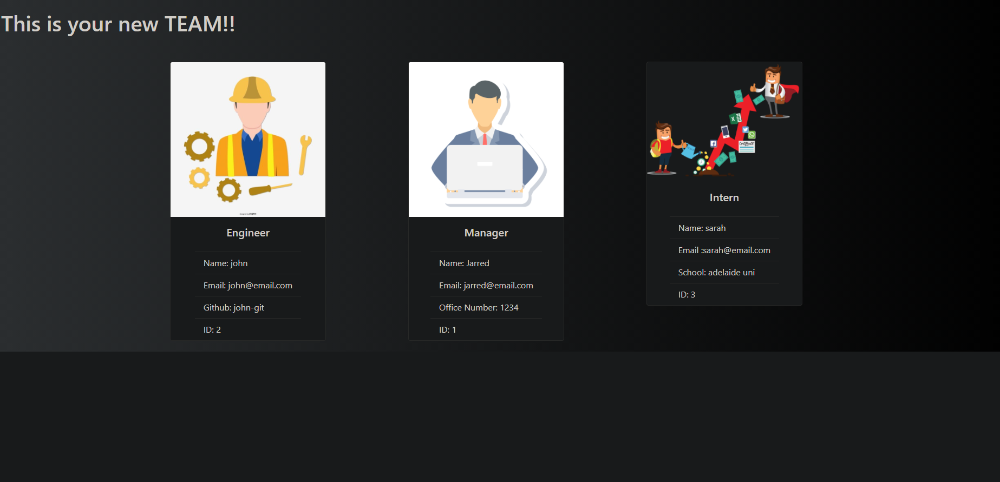

# Team Profile Generator

  ## Description
  The idea for this project was to creat a back end creation tool that would allow employees to be added to a teram profile Html page

  

  * [Installation](#installation)
  * [Technology](#technology)
  * [Usage](#usage)
  * [Contribution](#contribution)
  * [Test](#test)
  * [License](#license)
  * [Questions](#questions)
  

## Installation
node.js  

## Technology
to run the main inquirer function, in the idex.js files terminal, run node index.js  to begin the question prompts. In the main file, run npm run test to begin the testing process

## Usage
none

**explaining my project**

This was a much larger and more complex assignment than I expected it to be but I did learn a great deal while working through it.

The big thing i want to say up front is at time of submission, it is not quite complete. I just cant get anything to push to my Html file. i have spent alot of time on this one and cant get the final part working so need to submit it uncompleted so i dont fall behind with the future projects. i do wish to complete this though as I think alot of this project would be very useful. 

## Contribution
Sole contributor to this project. No starting code was provided so had to begin the project from scratch. I have created all the files and code seen in my submission. I did do research into the coding syntax and used past class activities as a catalyst to get the project to where it is now

## Test
there are 4 .js test files for each of the classes. typing npm run test to begin this process

## License 

[click for page link] (https://jarred-caris.github.io/team_profile_generator/.)

## Questions
If you have fursther questions, you can reach me at
[Github](https://github.com/Jarred-Caris)
or
jarred.caris@gmail.com
